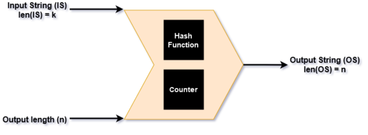

# Optimal Asymmetric Encryption Padding (OAEP)

Optimal Asymmetric Encryption padding (OAEP) is one of the Padding Schemes which is employed with RSA. It was officially published in [RFC2437](https://datatracker.ietf.org/doc/html/rfc2437) in October 1998. OAEP is the preferred padding scheme since it is considered to be [IND-CCA2](https://en.wikipedia.org/wiki/Ciphertext_indistinguishability) secure. However, there have been studies which contradict this claim stating OAEP is only [IND-CCA1](https://en.wikipedia.org/wiki/Ciphertext_indistinguishability) secure. OAEP also employs a Hash function and a [Mask generation function](https://en.wikipedia.org/wiki/Mask_generation_function) while forming the encoded message.

## Key components of OAEP:

OAEP has the following key components when encoding the message:-
- Hash function Hash() with length `hlen` bytes.
- Mask Generation Function(MGF) mask() which produces masked output of given length.
  - MGF functions as: `mask(ip, n) = op` where `len(op) = n`.

- Optional Label for each message. In our case, we consider label is always empty string.
- Flowcharts for Encoding and Decoding using OAEP can be viewed [here](OAEP_Schema.png).

## Encryption using OAEP

Let RSA Algorithm used have k byte modulus.
OAEP Encoding works as follows:-
- Length checking message(m):-
  - If `len(m) > k - 2 - 2 * hLen`, report error and stop.
- Create data block (DB):-
  - Append Hash(L) as start of string.
  - Append (k - len(m) - 2 * hLen - 2) 0x00 bytes.
  - Append 0x01 as seperation byte to mark end of 0x00 bytes.
  - Append message to form DB of length k - hLen - 1.
- Generate random seed (s) where len(s) = hLen bytes.
- Generate `DBmask = mask(s, k - hLen - 1)`
- Generate `maskedDB = DBMask xor DB`
- Generate `seedMask = mask(maskedDB, hLen)`
- Generate `maskedSeed = seedMask xor seed`
- Generate Encoded message `(EM) = 0x00 || maskedSeed || maskedDB`
- EM is then encrypted using public-key pair RSA and ciphertext is generated.

## Decryption using OAEP

Let RSA Algorithm used have k byte modulus.
- Length check Ciphertext (c):-
  - if `len(c) != k bytes` OR `len(c) < 2hLen + 2`, report error and stop.

- Ciphertext is decrypted using RSA private-key pair RSA to acquire Encoded message (EM).

OAEP Decoding works as follows:-
- Split EM as `0x00`, `maskedSeed` and `maskedDB`.
- Recreate Data Block (DB):-
  - Generate `seedMask = mask(maskedDB, hLen)`
  - Generate `seed = seedMask xor maskedSeed`
  - Generate `DBmask = mask(s, k - hLen - 1)`
  - Generate `DB = DBMask xor maskedDB`

- Split data block (DB):-
  - Discard Hash(L) as start of string.
  - Discard 0x00 bytes until seperation byte 0x01 is encountered.
  - If 0x01 is not encountered, report error and stop.
  - Discard 0x01 and recover original message.

