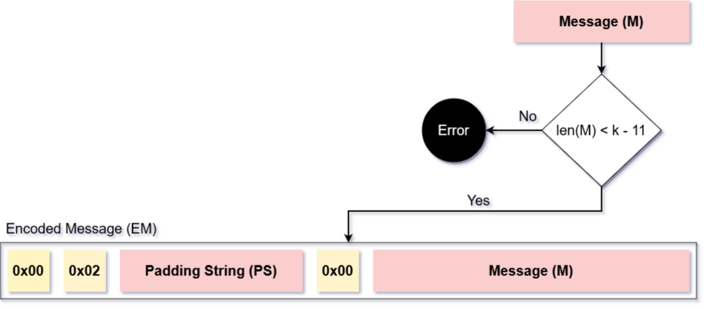
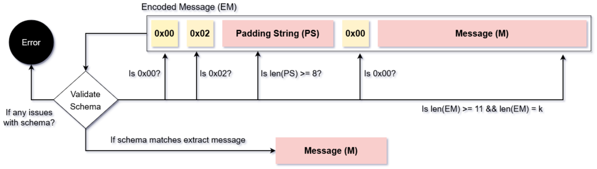

# Public-Key Cryptography Standard (PKCS) #1 v1.5

Public-Key Cryptography Standard (PKCS) #1 v1.5 is one of the Padding Schemes which is employed with RSA. It was officially published in [RFC2313](https://www.rfc-editor.org/rfc/rfc2313) in March 1998. It is fairly simple to implement but is susceptible to timing attacks. PKCS #1 v1.5 is considered broken, since there is a known attack against it called Bleichenbacher's attack. [Federal information Processing Standard (FIPS) 186-4](https://nvlpubs.nist.gov/nistpubs/FIPS/NIST.FIPS.186-4.pdf) outlines the current Digital Signature Standard. Despite being broken, FIPS 186-4 still recommends PKCS #1 v1.5 as a viable Padding Scheme with RSA.

## Encryption using PKCS #1 v1.5

As explained in [How RSA works with Padding Schemes?](ps.md), Padding schemes are used for encoding the input message. This encoded message is then used as the input message to be encrypted by RSA. The encoding for PKCS #1 v1.5 works as displayed below:-

The input string for RSA is usually the same length as the RSA Modulus. Let the length of the RSA modulus be k bytes. Padding schema for PKCS #1 v1.5 is as follows:-
- Minimum length for padding is 11 bytes. Out of these 11 bytes, the starting 2 bytes and last byte of the padding are fixed.
- Hence, the randomized padding is atleast 8 bytes long. Since the minimum length of padding is 11 bytes, the maximum permitted length for the input message is k-11 bytes.

Thus, encryption using PKCS #1 v1.5 has the following steps:-
- Let the number of bytes in the RSA modulus be k.
- Length checking the input message:
  - If the input message has a length > k - 11 bytes, report error and stop.
- Create encoded message as follows:-
  - Add 0x00 as 1st byte
  - Append 0x02 as 2nd byte
  - Append (k - 8 - len(message)) non-zero bytes as randomized padding bytes.
  - Append 0x00 as seperation byte.
  - Append input message to form final encoded message.
- Use encoded message as input for encryption with RSA using public key pair to output ciphertext.

## Decryption using PKCS #1 v1.5

Decryption using PKCS #1 v1.5 functions as follows:-
- Decrypt ciphertext using RSA private key pair and output encoded message.
- Validate encoded message to acquire original message as follows:-
  - Length checking encoded messsage (EM):
    - If len(EM) != k or len(EM) < 11, report error and stop.
  - If 1st byte is not 0x00, report error and stop. Else, discard byte.
  - If 1st byte is not 0x02, report error and stop. Else, discard byte.
  - Traverse bytes until 0x00 is encountered. If number of bytes traverse < 8, report error and stop. Else, discard bytes.
  - If 1st byte is not 0x00, report error and stop. Else, discard byte.
  - Since all padding bytes are discarded, original input message can now be extraced.

The above validation process can be visualized as follows:-

