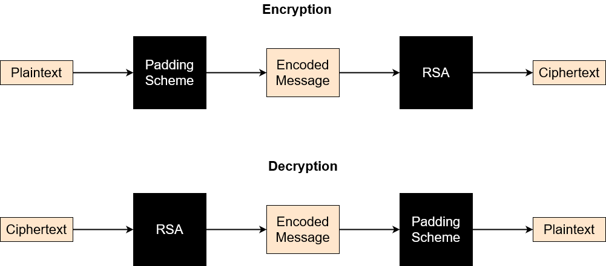

# Padding Schemes for RSA

As mentioned in [Why RSA? Why are Padding Schemes required?](rsa_info.md), RSA is almost always employed using a padding scheme. Padding schemes help RSA become a probabilistic agorithm. This helps RSA be completely resistant to chosen plaintext attacks. The main Padding schemes usually employed with RSA are:-

- Public-Key Cryptography Standard (PKCS) #1 v1.5
- Optimal Asymmetric Encryption Padding (OAEP)

## How Padding Schemes are used with RSA
Padding Schemes are used to modify the input message. The modification mostly involves adding octets to the input message based on a pre-defined schema. In the case of OAEP, hash functions are also used along with Mask Generation functions. The basic architecture for using RSA with a padding scheme is as follows:-

As seen above, on the senders end, the input message is encoded by the padding scheme and then encrypted using RSA. On the receiving end, the ciphertxt is decrypted using RSA and then decoded using the padding scheme.
